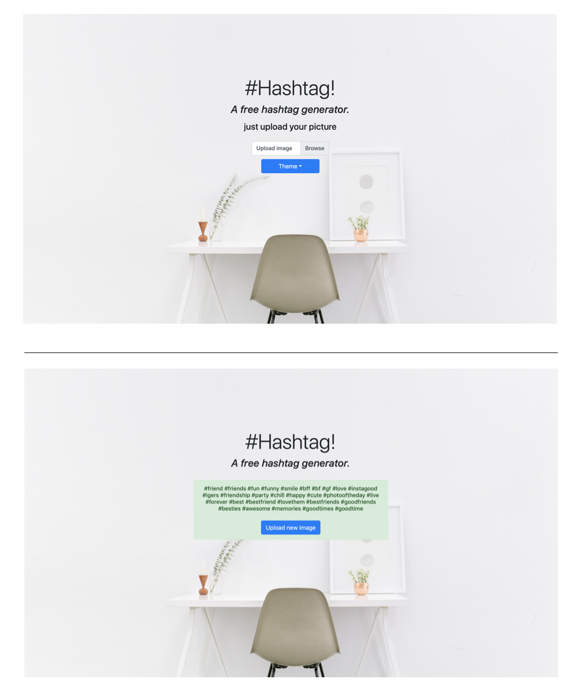
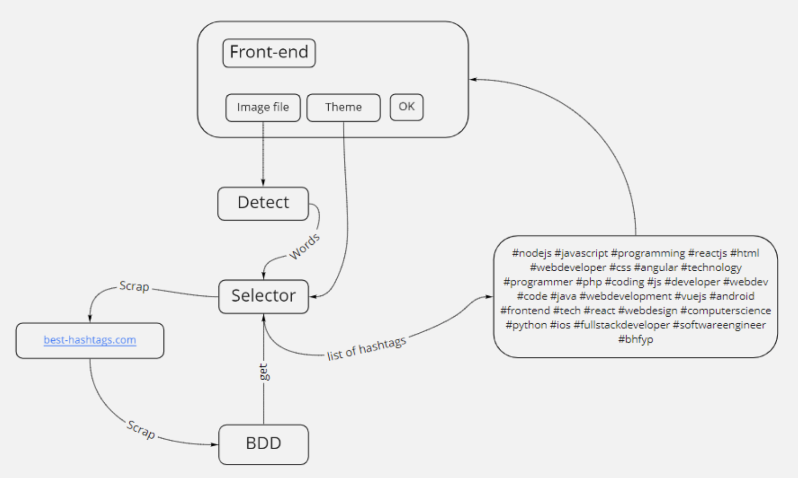

# Projet Semestre Client/Serveur: Hashtag Detector  :zap:

<strong>Ecole d'ingénieur:</strong> ESME Sudria, Majeur: Intelligence artificiel, Matiére: Client/Serveur.

<strong>Projet:</strong> Réalisation d'une plateforme qui permet de générer des Hashtags en fonction d'une image et des tendances.

<strong>Groupe:</strong> Razafindrabe Nathanaël, De Massé Grégoire, Joseph Paris, Arthur Agostini

## Hashtag Detector, Présentation projet :computer:

Proposer un service pour les personnes qui souhaitent générer des hahtag en fonction d'une image et de la tendance des hashtag.

Hashtag project est le nom de notre projet qui consiste à générer automatiquement une liste de hashtag en fonction d’un thème 
est d’une photo. Notre site internet pourrait faire gagner beaucoup de temps aux influenceurs ou utilisateurs fréquents d’ Instagram. 

Pour notre projet, nous avions donc besoin de récupérer les Hashtag et leurs popularité. Pour cela nous avons fait du scrapping sur 
<a href='http://best-hashtags.com/'>Best Hashtag</a>. Dans la partie suivante nous verrons l’architecture que nous avons utilisé pour notre application. 

Une fois le projet cloner:

    -  Aller à la route du projet  
    -  taper la commande: docker-compose up
    
    

Comment ca marche:

<ol>
<li>Cliquer sur browse</li>
<li>Choisisez une photo à uploader</li>
<li>Cliquer sur "Theme" et choisir choisir un theme</li>
</ol>

<strong>Attention!!!</strong> Lorsqu'on upload une photo, la photo est bien prise en compte par contre son nom ne s'affiche pas dans la
box d'Upload. C'est Un bug venant de Bootstrap sûrement.

    

## Etat de l'art, :blue_book:

## Structure Code, dossiers et les différents fichiers  :open_file_folder:

###### Front  
    Frontend du service
    Outils utilisés: HTML/CSS, Javascript & AJAX, Docker
    
###### Selector  
    Api for hashtag recommendation
    Outils utilisés: Python & Flask, Docker
    
###### Detect  
    Api for image recognition
    Outils utilisés: Python & Flask, Docker

###### BDD  
    Base de données
    Outils utilisés: Python & Flask, Docker, Psycopg2, BeautifulSoup
    
## Vue d'ensemble Projet, schéma, image et Photo  :notes:

<strong>Explication: </strong> 
<ol>
<li>Sur le front, l’utilisateur doit renseigner une photo et un thème. </li>
<li>La photo est ensuite analysé via le Docker “Detect” qui renvoie la liste 
des éléments présents sur l’image (grâce à une Api de détection d’image quelconque). </li>
<li>Selector est le conteneur qui prends en entrée le thème renseigné et les mots détectés 
par “Detect” et renvoi une liste de hashtag au front. Afin de pouvoir générer des hashtags en fonction du thème, 
Selector demande au docker qui contient la base de donnée une liste de hashtag relié au thème. Pour remplir la base de donné, le selector scrap à un 
interval de temps régulier le site best-hashtags.com </li>
</ol>

###### Docker compose  
    version: '3'
    
    services:
        detect:
            build: ./detect
            ports:
            - 8080:8080
  
          selector:
            build: ./selector
            ports:
            - 1997:1997
            # volumes:
            # - ./selector:/app # for dev
        
          bdd:
            image: postgres
            ports:
            - 5432:5432
            environment: 
            - POSTGRES_USER=user
            - POSTGRES_PASSWORD=user
            - POSTGRES_DB=hashtagbdd
        
          front:
            build: ./front
            ports:
            - 5000:5000

## Front End, expliquation :clapper:   
 
## Back End, expliquation :microscope:
 

Le back end consiste en 3 conteneurs docker :

<ul>
<li>
<strong>Detect:</strong> Grâce à une Api, ce conteneur permet d’identifier les éléments importants de l’image. Par exemple le sujet de la photo, le lieu où elle a été prise, les personnes présentes…’importe quelle api peut être utilisée, l'API Vision de Google par exemple permet de détecter les entités présentes sur l'image, le contexte général, ainsi que la localisation avec les métadonnées de la photo. On peut même envisager de faire nous même un réseau de neurones qui propose des hashtags parmi les plus populaires. Actuellement
</li>
<li>
<strong>Selector:</strong> Selector est le conteneur principal de l’application car c’est elle qui va communiquer via des micro services avec les autre conteneurs. Pour faire ses microservices nous avons mis en place un serveur grâce à flask. D’autre part,afin de récupérer les hashtags et leur popularité nous avons scrapé un site à l’aide de BeautifulSoup en python.
</li>
<li>
<strong>BDD:</strong> Notre base de donnée est une base de donnée relationnelle en postgres avec 2 tables: Une table Hashtag et une table related-hashtag. La table Hashtag contient le nom du hashtag et sa popularité (nombre d'utilisations globales et nombre d'utilisations sur la dernière heure). La table related hashtag permet d'associer à chaque hashtag un autre hashtag qui est similaire
</li>
</ul>

<strong>Un peu de détail sur "Selector"</strong>

Le principal du back c’est le container "Selector". 
C’est cela qui sert à récupérer les infos sur le site.

On a une fonction <strong>hashtag_to_bdd</strong> qui prend en paramètre un hashtag et qui vas scarper tout les hashtag relié à celui-ci. Ensuite le but de la fonction est de mettre à jour la base de données avec le nouveau hashtag et les hashtags qui lui sont reliés. Les informations que l’ont insert dans la bdd sont le nom du hashtag, sa popularité et son nombre de posts par heure. 

Dans database.py il y a toutes les fonctions utiles pour manipuler la base de données. Les deux principales fonctions présentes dans ce fichier sont : add_update_hashtag et add_remations.

<ul>
<li>
Add_update_hashtag est une fonction qui prend en entrée le hashtag, sa popularité et son nombre de poste par heure. Si le hashtag n’existe pas dans la base de données, il est ajouté. Si le hashtag existe déjà dans la base de données alors sa popularité et son nombre de posts par heure sont mis à jour.
</li>
<li>
Add_relations est une fonction qui prend en entrée un hashtag ainsi qu’une liste de hashtags reliées. La fonction sert à insérer tous les hashtag reliées dans la base de données.
</li>
</ul>

Api_bdd.py contient ce qui va permettre de generer un serveur avec plusieurs endpoint afin que le front et le back de notre application puisse communiquer.

Il y a trois principaux endpoint à retenir : 
<ol>
<li>/insert </li>
<li>/hashtag </li>
<li>/selector </li>
</ol>

<strong>Expliquation: </strong>

<ol>
<li>
/insert et le endpoint qui va permettre d’insérer le hashtag ainsi que les hashtags reliées dans la base de données. Pour cela il suffit de faire une get request en mettant en paramètre le hashtag concerné. 
</li>
<li>
Le endpoint /hashtag sert à récupérer tout les hashtag similaires dans la base de données. Pareillement, il suffit de faire une get request avec l’url pour récupérer la liste de hashtags .
</li>
<li>
Enfin le endpoint /selector permet de sélectionner les hashtags de la base de données reliées à un thème et de les renvoyer sous la forme d’une liste. Cette liste pourra ensuite être affichée sur le front.
</li>
</ol>

<code>api.add_resource(bdd_insert, '/insert/<string:hashtag>')</code> 
<code>api.add_resource(bdd_retrieve, '/hashtag/<string:hashtag>')</code> 
<code>api.add_resource(selector, '/selector/<string:theme>')</code> 

## Conclusion :page_with_curl:
 

Nous avons été très impressionné par la maniabilité et la facilitéde réaliser une application grâce à Docker. 
Grâce à ce projet nous avons appris à utiliser cette technologie qui nous sera très utile dans le futur.
